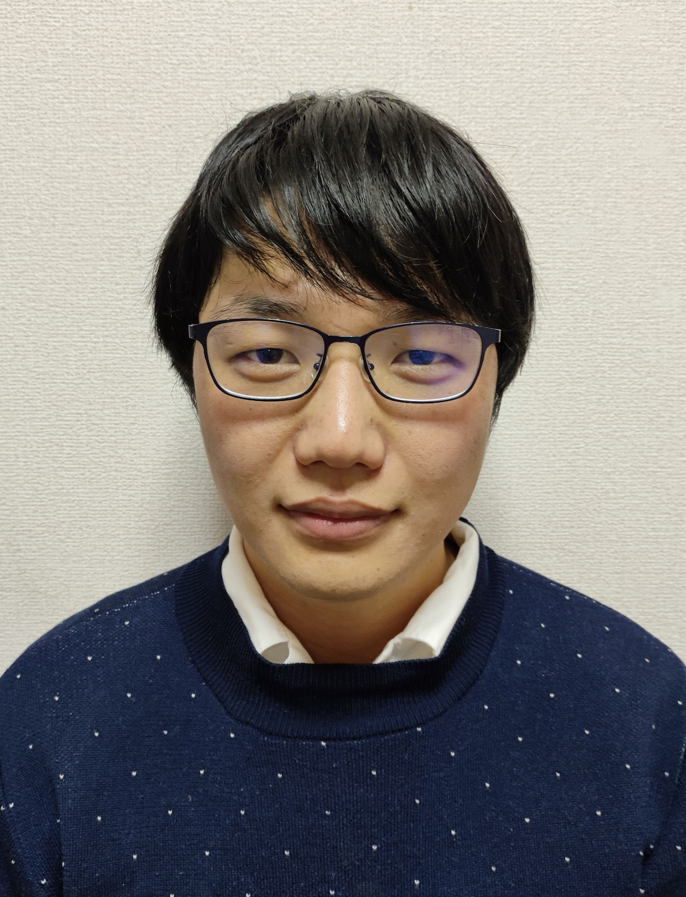

# Employment

Apr 1, 2022 – Present  
Assistant Professor (Tenure-track),  
[Theoretical Astrophysics Group](https://www2.ccs.tsukuba.ac.jp/Astro/home/en/), 
Center for Computational Sciences, University of Tsukuba

Apr 1, 2019 – Mar 31, 2022  
Researcher,  
Theoretical Astrophysics Group, 
Center for Computational Sciences, University of Tsukuba 

# Education

Mar 25, 2019  
Ph.D. in Science,
[Theoretical Astrophysics Group](https://www-tap.scphys.kyoto-u.ac.jp/top-e.html), Graduate School of Science, Kyoto University  

Mar 31, 2016  
M.Sc., Department of Physics, Kyoto University (Theoretical Astrophysics Group)

Mar 31, 2014  
B.Sc., Kyoto University  

Mar 31, 2009  
Graduated from Hibiya High School, Tokyo  

Jul 1, 2015 – Sep 3, 2017  
Visiting student, Theoretical Astrophysics Group in Tohoku University  

# Additional Information

Born in Fujieda, raised in Kasai.  

Lived in Kyoto → Sendai → Ibaraki → Tsukuba.  

Interests: Visiting parks, watching baseball (mainly the Chiba Lotte Marines), coffee.  

